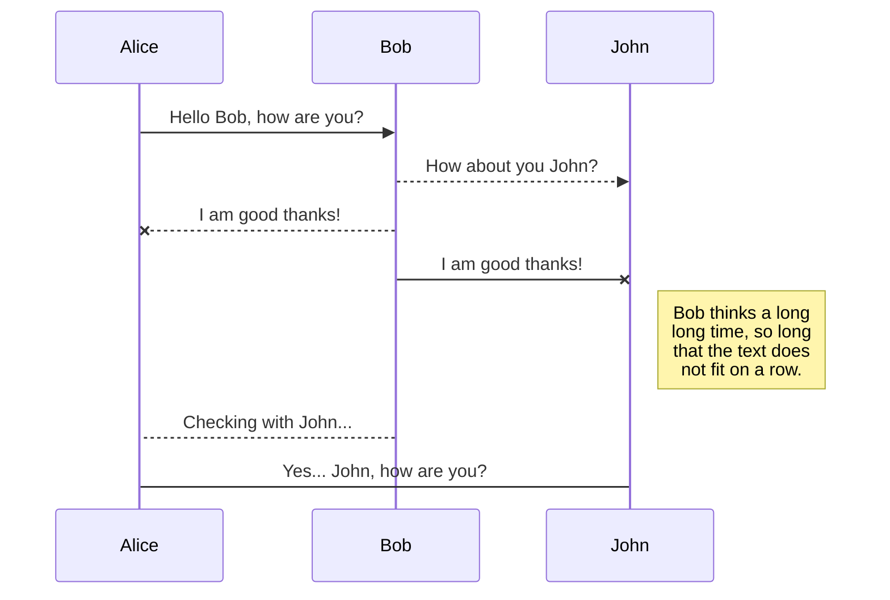
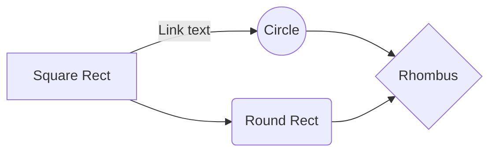

# File System

What is File System?
---
>OS가 파티션이나 디스크에 데이터를 RW 하기 위해 구성하는 일련의 체계

 

* OS 설치 -> 파티션 분할 -> 포맷 -> file system이 구성됨 -> OS가 data RW 가능
* file system에 따른 규칙:
	* 파일명 길이, 파티션 크기, 파일 크기, 디렉토리 수,...
* 리눅스 파일 시스템
	* Minix File System -> ext -> ext2 -> ext3 -> ext4 ->xfs
    * proc: 리눅스에서 사용하는 가상 파일 시스템
    * ext3 부터 저널링 도입
    * 저널링: 파일 시스템에 대한 변경사항을 반영하기 전에 로그에 변경사항을 저장하여 추적이 가능하게 만든 것. 시스템 오류 발생시 복구 확률을 높여준다. 

---

* **MFS(Minix File System)**
    * 최대 크기: 64MB
    * 파일 이름의 최대 길이: 14byte or 30byte
* **ext**
    * Estended File System
    * = ext1
    * Linux 운영체제를 목표로 만들어진 첫번째 file system
    * MFS의 한계를 극복하기 위해 만들어짐
    * File System 최대 볼륨 크기: 2GB
    * 파일 이름의 최대 길이: 256byte
    * 지원하지 않음: 분리접근, inode 수정, 자료 수정, 타임스탬프
* **ext2**
    * ext1의 파일 시스템 코드를 바탕으로 구성
    * 최대 파일 크기: 16GB ~2TB
    * File System 최대 볼륨 크기: 2TiB~32TiB
    * 파일 이름의 최대 길이: 256byte
    * 분리접근, inode 수정, 타임스탬프 지원 개선
* **ext3**
    * 저널링 기능
    * 비정상적 시스템 셧다운 상황에서
        * 점검 안해도 된다
        * 복구 시간이 빠름
        * 강력한 데이터 무결성을 보장
    * 온라인 파일 시스템 증대
    * 큰 디렉토리를 위한 HTree4 인덱싱 기능
    * 다른 저널링 시스템으로 변환이 용이
    * 데이터가 빈번하게 변화하는 디렉터리에 적합
* **ext4**
    * 16TB까지의 파일 지원
    * ext2,3의 block mapping 방식 대신 extends 방식을 새로 사용하여 큰 파일 처리를 개선하고 조각화 현상을 줄인다.
    * 저널 체크섬 기능 추가하여 파일 시스템 손상 가능성 줄였다.
    * 온라인 조각 모음 지원
* **JFS**
    * IBM의 독자적인 저널링 파일 시스템
    * GPL로 공개하여 리눅스용으로 개발중
* **XFS**
    * 64bit 환경에 최적화 
    * 이론상 900TB까지 지원이 가능
    * 같은 용량 ext3 대비 8배 많은 inode 생성 가능
    * 파일시스템 체크
        * 사용중인 inode만을 대상으로 하기 때문에 체크 소요시간이 적음
    * 대용량 위주 파일 시스템이다보니 작은 사이즈의 파일에서는 되려 속도가 느린 부분이 있음
    * 디버그 옵션이 존재하지 않아서 삭제된 파일은 복구가 불가능
    * 안정적임
    * GPL로 공개하여 리눅스용으로 개발중
* **UNIX의 i-node**
    * 파일이나 디렉토리의 모든 정보를 가지고 있는 자료구조.
    * 64byte로 구성
    * 어떤 한 파일이나 디렉토리가 생성되면 하나의 i-node가 만들어지고 그 i-node가 i-list에 등록된다.
    * i-list: i-node번호들의 목록
    * i-number: i-node가 i-list에 등록되는 entry-number
    * 내용
        * 파일소유권 정보, 접근권한 정보
        * 디스크 내 파일 내용이 들어있는 위치의 물리적 주소
        * 파일의 링크수, 형태, 크기
        * 생성시간, 최근 사용시간, 최근 수정 시간
        * i-node의 최근 수정 시간

---

* **Volume**
    * OS 환경에서'' volume' 또는 'logical drive' 는 '하나'의 파일 시스템을 갖춘 접근 가능한 스토리지 영역을 말함
    * 파일 시스템으로 포맷된 하드 디스크 상의 저장 영역
    * 볼륨에는 드라이브 문자(C 드라이브, D 드라이브.....)가 할당
    * 단일 하드 디스크에 여러개의 볼륨이 있을 수 있고 일부 볼륨은 여러개의 하드 디스크로 span될 수 있다.
    * 일반적으로 하드 디스크의 단일 파티션에 상주
    * 물리 디스크 드라이브와 다를 수 있지만 OS의 logical interface로 접근할 수 있다.
    * OS의 context에서 사용된다.
* **Partition**
    * 저장 장치 내부에서 데이터를 저장하기 위해 논리적인 단위를 매기는데 이대 연속된 저장 공간으로 나누는 것을 partitioning이라 하며 그 연속된 공간을 partition이라고 함.
    * 예로, 디스크 하나는 partition을 통해 공간을 나누어 사용할 수 있는데 이는 한개의 디스크가 연속된 공간으로 이루어져 있기 때문
    * 그래서 두개의 디스크가 있을 경우에는 두개의 디스크 자체가 물리적으로 연속된 공간이 아니기 때문에 하나의 파티션이 두개의 디스크에 걸쳐 존재하는 것은 불가능하다.
* **Volume  VS Partition**
    * 공간의 연속 여부
    * partition: 
        * 연속된 sector들의 집합
    * volume:
        * sector들의 집합
        * 연속되지 않아도 상관없음
    * volume 이 partition을 포함하는 개념이라고 볼 수 있다.
* **Mount**
    * 특정 디렉토리에 파일시스템을 탑재하는 것, 하드웨어 장치를 사용하기 위해 리눅스 운영체제에 인식할 수 있게 해준다.
    * 특정 장치를 하나의 디렉토리처럼 사용하기 위해 수행하는 작업
    * 리눅스 파일 단위로 모든 장치를 관리하기 때문에 새롭게 만든 파일 시스템을 사용하기 위해서는 디스크 장치를 임의의 디렉토리(mount point)에 마운트시켜 사용해야 한다.
* **Drive**
    * 드라이브 문자가 지정된 저장 영역
    * 디스크, CD, 플로피 디스크, 등등.......
    * 즉, 볼륨에 드라이브 문자를 할당하면 해당 볼륨은 지정된 문자의 드라이브가 되는 것
    * 드라이브 문자를 지젖앟ㄹ 수 있는 모든 장치와 기타 저장 공간들도 문자를 할당받는 순간 드라이브가 되는 것
* **EC2-EBS**
    * EBS : Elastic Block Storage
    * 일종의 하드 디스크Welcome to StackEdit!

Hi! I'm your first Markdown file in **StackEdit**. If you want to learn about StackEdit, you can read me. If you want to play with Markdown, you can edit me. Once you have finished with me, you can create new files by opening the **file explorer** on the left corner of the navigation bar.

# Files

StackEdit stores your files in your browser, which means all your files are automatically saved locally and are accessible **offline!**

## Create files and folders

The file explorer is accessible using the button in left corner of the navigation bar. You can create a new file by clicking the **New file** button in the file explorer. You can also create folders by clicking the **New folder** button.

## Switch to another file

All your files are listed in the file explorer. You can switch from one to another by clicking a file in the list.

## Rename a file

You can rename the current file by clicking the file name in the navigation bar or by clicking the **Rename** button in the file explorer.

## Delete a file

You can delete the current file by clicking the **Remove** button in the file explorer. The file will be moved into the **Trash** folder and automatically deleted after 7 days of inactivity.

## Export a file

You can export the current file by clicking **Export to disk** in the menu. You can choose to export the file as plain Markdown, as HTML using a Handlebars template or as a PDF.

# Synchronization

Synchronization is one of the biggest features of StackEdit. It enables you to synchronize any file in your workspace with other files stored in your **Google Drive**, your **Dropbox** and your **GitHub** accounts. This allows you to keep writing on other devices, collaborate with people you share the file with, integrate easily into your workflow... The synchronization mechanism takes place every minute in the background, downloading, merging, and uploading file modifications.

There are two types of synchronization and they can complement each other:

- The workspace synchronization will sync all your files, folders and settings automatically. This will allow you to fetch your workspace on any other device.
	> To start syncing your workspace, just sign in with Google in the menu.

- The file synchronization will keep one file of the workspace synced with one or multiple files in **Google Drive**, **Dropbox** or **GitHub**.
	> Before starting to sync files, you must link an account in the **Synchronize** sub-menu.

## Open a file

You can open a file from **Google Drive**, **Dropbox** or **GitHub** by opening the **Synchronize** sub-menu and clicking **Open from**. Once opened in the workspace, any modification in the file will be automatically synced.

## Save a file

You can save any file of the workspace to **Google Drive**, **Dropbox** or **GitHub** by opening the **Synchronize** sub-menu and clicking **Save on**. Even if a file in the workspace is already synced, you can save it to another location. StackEdit can sync one file with multiple locations and accounts.

## Synchronize a file

Once your file is linked to a synchronized location, StackEdit will periodically synchronize it by downloading/uploading any modification. A merge will be performed if necessary and conflicts will be resolved.

If you just have modified your file and you want to force syncing, click the **Synchronize now** button in the navigation bar.

> **Note:** The **Synchronize now** button is disabled if you have no file to synchronize.

## Manage file synchronization

Since one file can be synced with multiple locations, you can list and manage synchronized locations by clicking **File synchronization** in the **Synchronize** sub-menu. This allows you to list and remove synchronized locations that are linked to your file.

# Publication

Publishing in StackEdit makes it simple for you to publish online your files. Once you're happy with a file, you can publish it to different hosting platforms like **Blogger**, **Dropbox**, **Gist**, **GitHub**, **Google Drive**, **WordPress** and **Zendesk**. With [Handlebars templates](http://handlebarsjs.com/), you have full control over what you export.

> Before starting to publish, you must link an account in the **Publish** sub-menu.

## Publish a File

You can publish your file by opening the **Publish** sub-menu and by clicking **Publish to**. For some locations, you can choose between the following formats:

- Markdown: publish the Markdown text on a website that can interpret it (**GitHub** for instance),
- HTML: publish the file converted to HTML via a Handlebars template (on a blog for example).

## Update a publication

After publishing, StackEdit keeps your file linked to that publication which makes it easy for you to re-publish it. Once you have modified your file and you want to update your publication, click on the **Publish now** button in the navigation bar.

> **Note:** The **Publish now** button is disabled if your file has not been published yet.

## Manage file publication

Since one file can be published to multiple locations, you can list and manage publish locations by clicking **File publication** in the **Publish** sub-menu. This allows you to list and remove publication locations that are linked to your file.

# Markdown extensions

StackEdit extends the standard Markdown syntax by adding extra **Markdown extensions**, providing you with some nice features.

> **ProTip:** You can disable any **Markdown extension** in the **File properties** dialog.

## SmartyPants

SmartyPants converts ASCII punctuation characters into "smart" typographic punctuation HTML entities. For example:

|                |ASCII                          |HTML                         |
|----------------|-------------------------------|-----------------------------|
|Single backticks|`'Isn't this fun?'`            |'Isn't this fun?'            |
|Quotes          |`"Isn't this fun?"`            |"Isn't this fun?"            |
|Dashes          |`-- is en-dash, --- is em-dash`|-- is en-dash, --- is em-dash|

## KaTeX

You can render LaTeX mathematical expressions using [KaTeX](https://khan.github.io/KaTeX/):

The *Gamma function* satisfying $\Gamma(n) = (n-1)!\quad\forall n\in\mathbb N$ is via the Euler integral

$$
\Gamma(z) = \int_0^\infty t^{z-1}e^{-t}dt\,.
$$

> You can find more information about **LaTeX** mathematical expressions [here](http://meta.math.stackexchange.com/questions/5020/mathjax-basic-tutorial-and-quick-reference).

## UML diagrams

You can render UML diagrams using [Mermaid](https://mermaidjs.github.io/). For example, this will produce a sequence diagram:

And this will produce a flow chart:

<!--stackedit_data:
eyJoaXN0b3J5IjpbLTUzNjE5OTc0OF19
-->